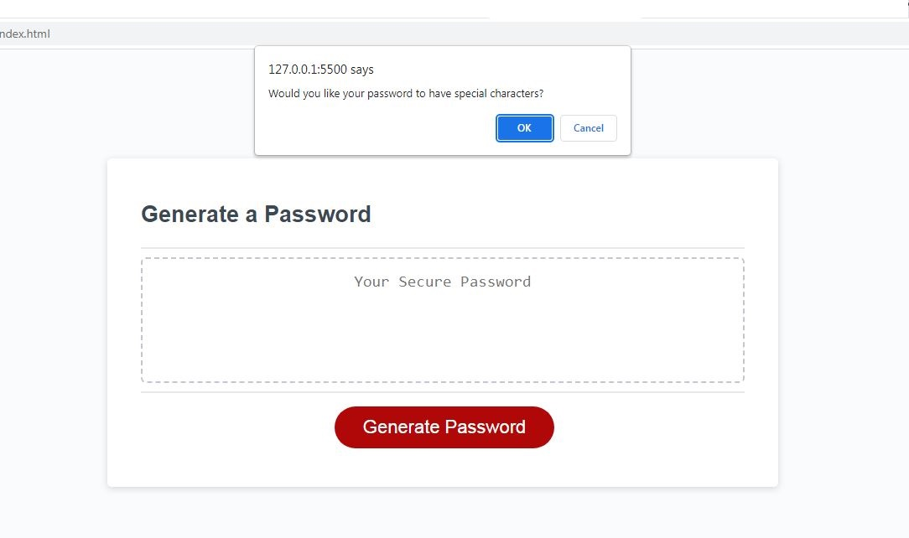
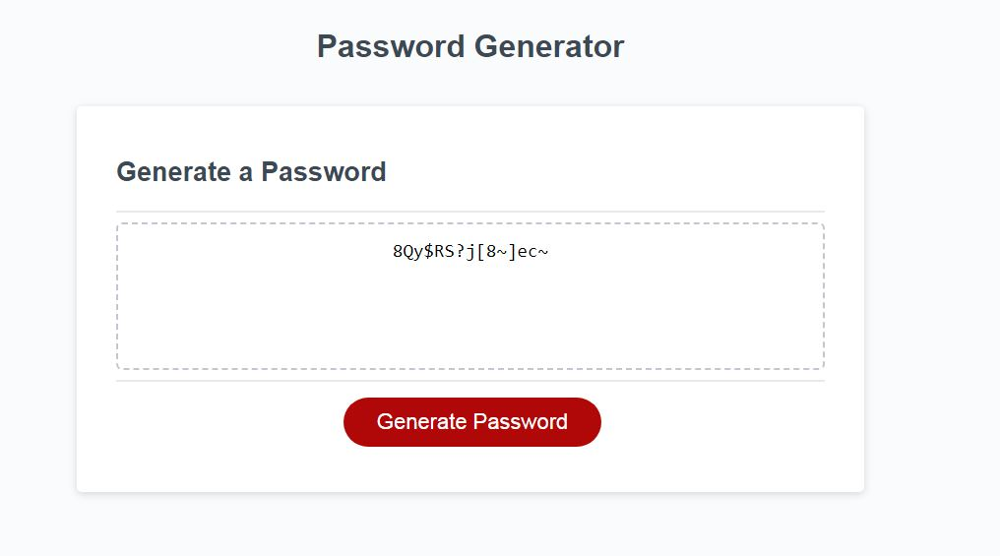

# Password-Generator

This is my Password-Generator project.

## **User Story**

The JavaScript generates a random password for the user based on the criteria they select: of a length 8 - 128 characters; should use at least one of uppercase, lowercase, numerical or special characters. The password will then be displayed for the user to see.

## **Site Link**

Visit my Password-Generator page here: https://brooksy236.github.io/Password-Generator/ 

## **Screenshots**

## **Installation**

_N/A_

## **Usage**

Click 'Generate Password' and follow the instructions.

## **License**

MIT License
